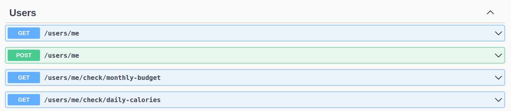

# Api Calorie Tracker

<p align="center">
    
</p>

## About:

Development of a backend application to implement an app that manages my food/caloric activities. Having use of TypeScript and Postgresql.

## Layout:

<table>
    <thead>
        <tr>
            <td>
                
            </td>
        </tr>
    </thead>
    <tbody>
        <tr>
            <th>
                
            </th>
        </tr>
        <tr>
            <th>
                
            </th>
        </tr>
        <tr>
            <th>
                
            </th>
        </tr>
    </tbody>
</table>


## How to run the project? 

The steps to access the project are very simple, but follow in the following order:

```bash
npm install
```

Configuring your file (.env) or dotenv

```bash
PORT_SERVER=8080

DB_HOST=localhost
DB_USER=azizbek
DB_DATABASE=calorie
DB_PASSWORD=12345
DB_PORT=5432
```

## Technologies 

The following tools were used in building the project:

### Backend (Node JavaScript)

- JavaScript
- Postgresql
- Nodejs

## Contributors

<table>
    <thead>
        <tr>
            <td>
                
            </td>
        </tr>
    </thead>
    <tbody>
        <tr>
            <th>Mateus Maciel</th>
        </tr>
    </tbody>
</table>

## How to contribute?

1. Fork the project.
2. Create a new branch with your changes: `git checkout -b my-feature`
3. Save the changes and create a commit message telling what you did: `git commit -m Modifying this [...]`
4. Submit your changes: `git push origin my-feature`

## License

This project is under license [MIT](https://github.com/git/git-scm.com/blob/main/MIT-LICENSE.txt).